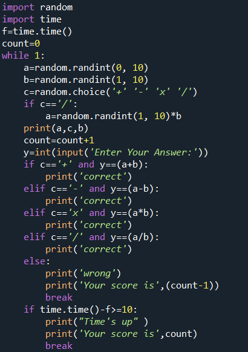
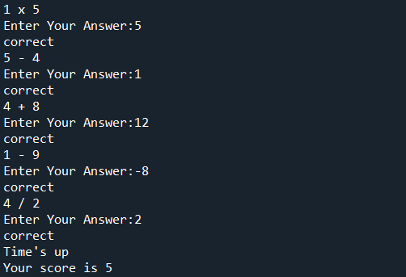

# ***Math Game***
## Game's introduction
My name is **Farhan Parwez Khan** and I have made a simple game using ***Python***. In this code i have used modules like *Random* and *Time*.
It is a simple game in which you have to answer as many arethematic questions as you can in 10 sec.
Here is the code behind:

Here is a sample of the output:

#### Hope you will have fun playing it
### Thank You
